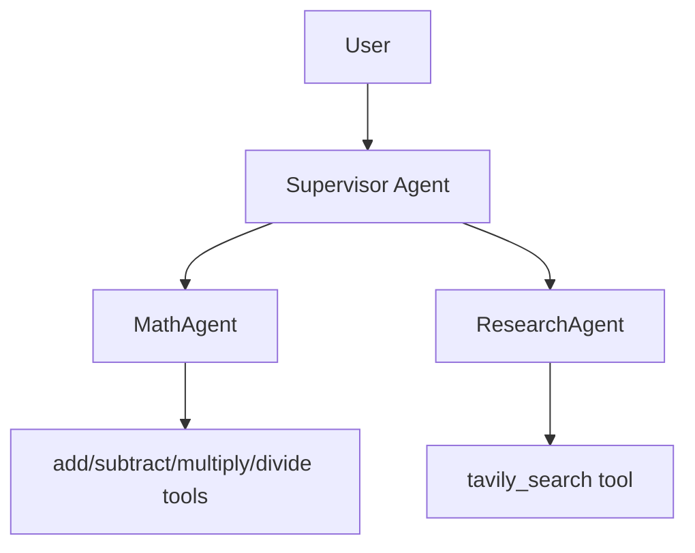

# OpenAI Agent SDK Supervisor

A multi-agent supervisor system built with the OpenAI Agents SDK that routes user tasks between:
- `MathAgent` for arithmetic and numeric reasoning
- `ResearchAgent` for Tavily-backed web research

## Architecture



## Prerequisites

- Python 3.11+
- OpenAI API key
- Tavily API key
- Braintrust API key (optional for local chat, required for eval logging)

## Environment

Create `.env`:

```env
OPENAI_API_KEY=...
TAVILY_API_KEY=...
BRAINTRUST_API_KEY=...
BRAINTRUST_PROJECT=openai-agent-sdk-supervisor
BRAINTRUST_ORG_NAME=Braintrust Demos
MODAL_APP_NAME=curtis-41436-openai-agent-sdk-supervisor-eval-server
```

Notes:
- `BRAINTRUST_PROJECT` defaults to `openai-agent-sdk-supervisor`.
- Use a Braintrust API key from the Braintrust Demos org (`29bd8276-80fc-4c70-a288-fc5ac901e5ef`).
- `MODAL_APP_NAME` is configurable so deploys are scoped to your own Modal namespace.

## Install

Using `uv`:

```bash
uv pip install -r requirements.txt --system
```

## Run Local Chat

```bash
python -m src.local_runner
```

## Run Evals

```bash
braintrust eval evals/
```

Or run a specific eval:

```bash
braintrust eval evals/eval_supervisor.py
```

## Modal Deployment (your own account)

1. Authenticate Modal:
```bash
modal setup
```
2. Ensure your intended Modal profile/account is active.
3. Set a unique app name in `.env` via `MODAL_APP_NAME` (already parameterized in `src/app.py` and `src/eval_server.py`).
4. Deploy:
```bash
modal deploy src/app.py
```
or
```bash
modal deploy src/eval_server.py
```

## Key Files

- `src/agents/deep_agent.py`: supervisor and handoff wiring
- `src/agents/math_agent.py`: math tools + math agent
- `src/agents/research_agent.py`: Tavily tool + research agent
- `src/local_runner.py`: local interactive runner
- `evals/eval_supervisor.py`: supervisor routing/quality eval
- `scripts/run_queries.py`: concurrent batch query runner
