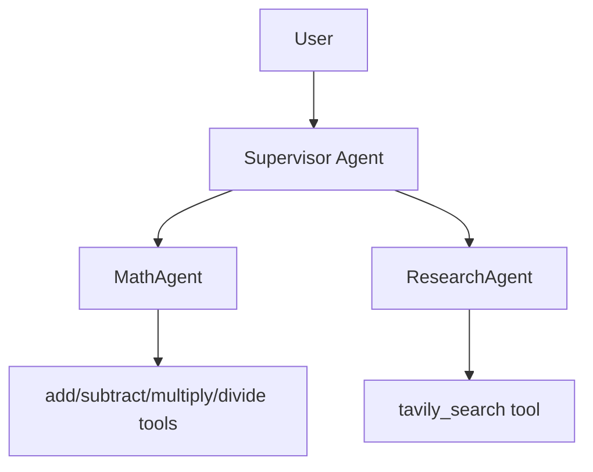

# OpenAI Agent SDK Supervisor

A multi-agent supervisor system built with the OpenAI Agents SDK that routes user tasks between:
- `MathAgent` for arithmetic and numeric reasoning
- `ResearchAgent` for Tavily-backed web research

## Architecture



## Prerequisites

- Python 3.11+
- OpenAI API key
- Tavily API key
- Braintrust API key (optional for local chat, required for eval logging)

## Environment

Create `.env`:

```env
OPENAI_API_KEY=<your-openai-api-key>
TAVILY_API_KEY=<your-tavily-api-key>
BRAINTRUST_API_KEY=<your-braintrust-api-key>
BRAINTRUST_PROJECT=<your-braintrust-project-name>
BRAINTRUST_ORG_NAME=<your-braintrust-org-name>
MODAL_APP_NAME=<your-modal-app-name>
```

Notes:
- `MODAL_APP_NAME` is configurable so deploys are scoped to your own Modal namespace.

## Install

Using `uv`:

```bash
uv pip install -r requirements.txt --system
```

## Run Local Chat

```bash
python -m src.local_runner
```

## Run Evals

```bash
braintrust eval evals/
```

Or run a specific eval:

```bash
braintrust eval evals/eval_supervisor.py
```

## Modal Deployment (your own account)

1. Authenticate Modal:
```bash
modal setup
```
2. Ensure your intended Modal profile/account is active.
3. Set a unique app name in `.env` via `MODAL_APP_NAME` (already parameterized in `src/app.py` and `src/eval_server.py`).
4. Deploy:
```bash
modal deploy src/app.py
```
or
```bash
modal deploy src/eval_server.py
```

## Key Files

- `src/agents/deep_agent.py`: supervisor and handoff wiring
- `src/agents/math_agent.py`: math tools + math agent
- `src/agents/research_agent.py`: Tavily tool + research agent
- `src/local_runner.py`: local interactive runner
- `evals/eval_supervisor.py`: supervisor routing/quality eval
- `scripts/run_queries.py`: concurrent batch query runner

## Project Structure

```text
openai-agent-sdk-supervisor/
├── src/
│   ├── app.py                   # Modal web endpoint
│   ├── eval_server.py           # Modal remote eval server
│   ├── local_runner.py          # Local interactive runner
│   ├── config.py                # Prompts, model defaults, and app config
│   └── agents/
│       ├── deep_agent.py        # Supervisor + handoff orchestration
│       ├── math_agent.py        # Math agent and arithmetic tools
│       └── research_agent.py    # Research agent and Tavily tool
├── evals/
│   ├── eval_supervisor.py       # Main multi-agent eval suite
│   └── eval_math_agent.py       # Focused math evals
├── scripts/
│   ├── run_queries.py           # Batch query runner for traces/examples
│   ├── retest_query.py          # Re-run a query from text or trace ID
│   └── generate_examples.py     # Build eval examples from historical traces
├── docs/
│   └── MODAL_EVAL_SERVER.md     # Braintrust Playground + Modal setup
├── scorers.py                   # Braintrust scorer definitions
├── requirements.txt
├── pyproject.toml
└── README.md
```

## Contributing

1. Fork the repository.
2. Create a branch for your change.
3. Make your updates and run relevant evals/tests.
4. Open a pull request with a concise description of behavior changes.

Development guidelines:
- Keep agent behavior changes in `src/config.py` and/or `src/agents/`.
- If routing behavior changes, update or extend `evals/eval_supervisor.py`.
- Keep scorer updates in `scorers.py` and push them to Braintrust when ready.
- Update this README when setup, scripts, or workflows change.

## License

This project is licensed under the MIT License. See `LICENSE` for details.

## Support

- Use this repository's GitHub Issues for bugs and feature requests.
- Include trace IDs, run IDs, or failing query examples when reporting eval issues.
- For Braintrust setup and remote eval usage, see `docs/MODAL_EVAL_SERVER.md`.
